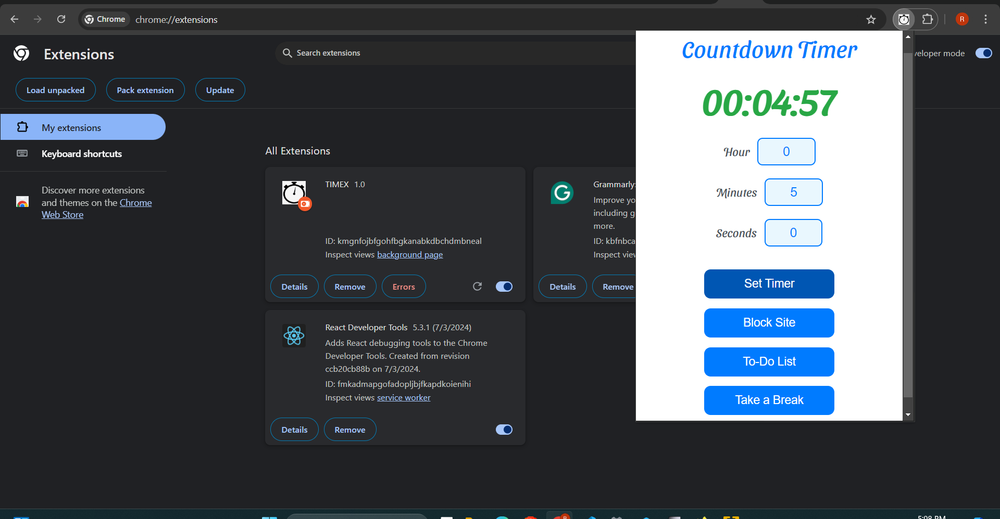

# Productivity-Management-Chrome-Extension
Timex is a Productivity Management extension. After downloading or whenever you start your browser open any web page to refresh…
Timex is a Productivity Management extension.

After downloading or whenever you start your browser open any web page to refresh and activate all your the feature(It is a one time task).

Click on the Timex icon a pop-up will be displayed showing your browsing time.

## Timex has the following features:-
#### Timer

---
A timer keeps track of the time you are on the browser. You can also set time for how long you want to work and remind you when the time is over.
#### Block Sites

---
The user can write the name of the websites he/she needs to block. Those websites would not be accessible to from the browser. You need to just write the name of the website instead of writing it as whole. You can remove the website from the block list by just deleting its name from the text area and  saving it again.
#### To-Do list

---

It helps the user to add tasks. The tasks can be classified into Completed and not Completed. Once a task is completed you can change it from not complete to complete.
#### Take a Break

---
This feature helps you to set break time. Just set the start and end time of the break in 24hr format. You would be notified at the start of the break and when the break ends. During the break all the sites would remain blocked.
 
All these features would help you to increase your productivity.
